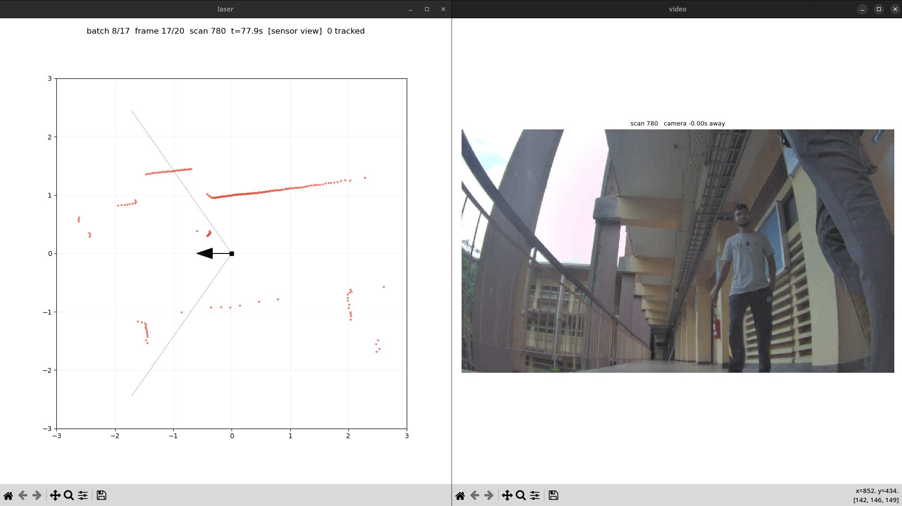

# laser-detection-annotator for multi object(human) id with ros2 bags.
A tool to annotate/label detections in a stream of laser data.

I extended the exisiting tool of [laser-detection-annotator](https://github.com/lucasb-eyer/laser-detection-annotator)for multi human annotation to collect a dataset for my project : [link](https://github.com/nilum2002/proactive-social-nav/).


[](image.png)


Run:

```
python3 anno_ros2.py <rosbag.mcap> --range 3 # range : sets the zoom
```

Export annotations for csv:

```
python3 export_tracks.py annotations.json
```
